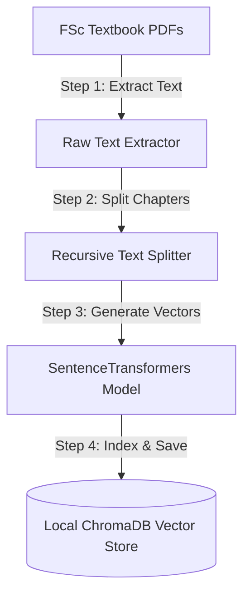
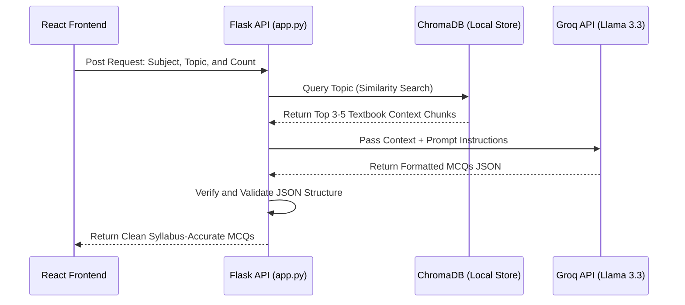

# Technical Proposal: RAG-Based MCQ Generation System
**Project Name:** EduNest (Final Year Project)  
**Document Goal:** System Architecture & Implementation Plan for the Project Supervisor  

---

## 1. Introduction and Objectives

This proposal describes the implementation of a Retrieval-Augmented Generation (RAG) system for the entry test preparation module of EduNest. Instead of relying on the general pre-trained memory of Large Language Models, this system retrieves specific textbook paragraphs related to the student's selected topic and feeds them directly to the AI model. This approach ensures that all generated questions strictly adhere to the official FSc Intermediate curriculum guidelines, eliminates factual errors (hallucinations), and moves API keys to a secure Python backend.

---

## 2. Academic Data Sources

The reference database is built using official FSc (Part 1 and Part 2) textbook PDFs for Physics, Chemistry, Biology, and Mathematics from the Punjab Curriculum and Textbook Board (PCTB), the Federal Board (FBISE), and the Sindh Textbook Board. We also collect past paper databases for MDCAT and ECAT to guide the AI on difficulty levels and entry test patterns.

---

## 3. System Architecture & Directory Layout

The RAG pipeline is hosted inside a Python Flask backend that connects with our React frontend, serving as a secure interface for database searches and LLM API calls.

```text
python_backend/
├── data/
│   ├── syllabus/          # Directory containing PDF textbooks
│   └── fallback_mcqs.json # Static offline fallback database
├── vector_db/             # Local database directory generated by ChromaDB
└── app.py                 # Flask server and RAG routing logic
```

---

## 4. Implementation Methodology

The implementation processed raw textbooks into a searchable database in four simple steps:



* **Text Extraction:** We use a Python script containing the `pypdf` library to read the official textbook PDFs page-by-page. The script extracts the raw text content from each page, removing metadata and unreadable formatting, and compiles it into clean, continuous text files for processing.
* **Dynamic Chunking:** Large book chapters exceed the input size limits of language models. We split the continuous text into smaller paragraphs (chunks) ranging from 500 to 1,000 characters using `langchain-text-splitters`. We keep a 100-character overlap between chunks to ensure that key ideas or sentences are not split in half at the boundaries.
* **Vector Embeddings:** To help the computer understand the meaning of the textbook chunks, we convert the text into mathematical arrays of numbers called vectors. This is done using a local, CPU-based `all-MiniLM-L6-v2` model from the `sentence-transformers` library, which maps semantically similar topics close to each other in a multi-dimensional space.
* **Vector Storage:** We store the generated vectors along with the original textbook paragraphs in a local database using `ChromaDB`. We also add metadata tags (such as Subject, Chapter Name, and Page Number) to each entry, which allows us to filter the database and query specific topics instantly.

---

## 5. Runtime Exam Generation Workflow

When a student starts an exam, the system generates the questions dynamically using the following flow:



The Flask API receives the student's request and queries the local ChromaDB database to retrieve the top 3 to 5 textbook paragraphs matching the topic. These paragraphs are injected into a prompt template, which instructs the Groq Llama 3.3 API to write multiple-choice questions strictly from the provided text. Finally, the backend validates the JSON formatting and returns the verified questions to the frontend dashboard.

---

## 6. Security, Reliability, and Cost Feasibility

By using local, open-source models (`sentence-transformers` and `ChromaDB`), we eliminate hosting costs and keep database search completely free. API keys are securely hidden in the Flask environment rather than the client browser. Additionally, a local pre-loaded JSON database is used as an offline fallback to ensure the application remains functional even if network API requests fail.
