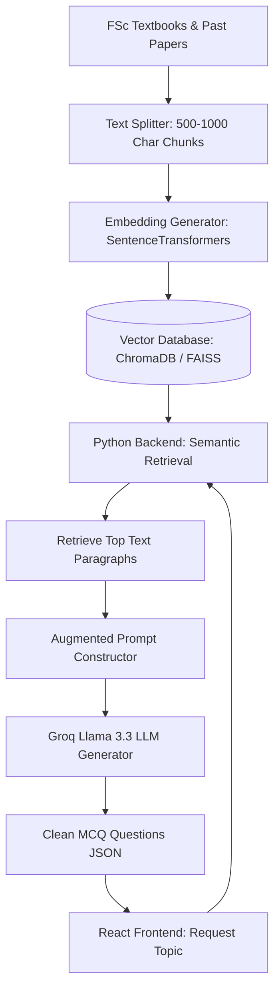

# EduNest — RAG-Based Mock Test Generation System Upgrade Plan

This document outlines the professional architectural upgrade plan to migrate the **EduNest Entrance Exam Module** from a **pure Prompt Engineering** model to a state-of-the-art **Retrieval-Augmented Generation (RAG)** architecture.

---

## 1. Architectural Evolution

The current system relies entirely on the model's pre-trained weights combined with specific prompt constraints. The proposed upgrade moves content control to a local, verified knowledge base.

| Feature / Metric | Current Prompt Engineering Model | Proposed RAG-Based Model |
| :--- | :--- | :--- |
| **Data Source** | Pre-trained LLM memory (General Knowledge) | Local FSc Textbook PDFs & Past Paper Databases |
| **Accuracy (Hallucination)** | Moderate (Possibility of out-of-syllabus terms) | Extremely High (Strictly restricted to verified text chunks) |
| **Syllabus Control** | Strict prompting text constraints | Physical file filtering (Federal, Punjab, Sindh boards) |
| **Security (API Key)** | Front-facing requests (Exposed in React code) | Behind-the-scenes secure queries (Python backend only) |

---

## 2. Dynamic Pipeline Architecture

The RAG pipeline will run entirely inside the secure **`python_backend`** and communicate with the React frontend through customized HTTP REST API endpoints.

---

## 3. Step-by-Step Implementation Roadmap

### Phase 1: Knowledge Base Collection (Data Source Setup)
*   **Action:** Create a secure directory `python_backend/data/syllabus/` containing text and PDF versions of official provincial and federal board textbooks (Physics, Chemistry, Biology, Mathematics).
*   **Past Papers:** Load standard MDCAT and ECAT past questions into a unified JSON database `python_backend/data/past_papers.json` to act as style/format references.

### Phase 2: Dynamic Chunking & Text Splitting
*   **Action:** Implement a Python document processor using a text-splitting package (e.g., `langchain` recursive text splitters).
*   **Standard Size:** Split full chapters into dense, overlapping chunks of **500 to 1,000 characters**. Overlapping (e.g., 100 characters) ensures that concepts crossing paragraph boundaries are not lost.

### Phase 3: Vector Embeddings Conversion
*   **Action:** Integrate a lightweight, high-performance mathematical embedding encoder (e.g., a free, locally running HuggingFace model like `sentence-transformers/all-MiniLM-L6-v2` or the official OpenAI embeddings API).
*   **Goal:** Convert text chunks into multi-dimensional floating-point vectors representing conceptual and semantic meanings.

### Phase 4: Local Vector Database Storage
*   **Action:** Install a lightweight, open-source local vector database (like **ChromaDB** or **FAISS**) running inside the `python_backend` workspace.
*   **Goal:** Store generated textbook and past-paper vectors in an indexed format optimized for instant semantic search.

### Phase 5: Augmented Query Processing & API Endpoint
*   **Action:** Construct a Flask API endpoint `/api/generate-rag-exam` inside `python_backend/app.py`:
    1.  Receive parameters: `examType`, `subject`, and optional `topic` from the frontend.
    2.  Query the local vector database using semantic search (cosine similarity) to retrieve the **top 3 to 5 most relevant paragraphs** matching the requested exam topic.
    3.  Assemble an augmented prompt: inject the retrieved textbook text as "Context" and instruct the LLM (Groq Llama 3.3) to formulate questions *strictly* from the provided content.
    4.  Return the verified questions to the frontend.

### Phase 6: Frontend Routing Updates
*   **Action:** Update the API fetch routing in `src/pages/student/MockExam.jsx` and `src/services/aiExamService.js` to target the local Python RAG API endpoint rather than making direct, unencrypted client-side calls to the Groq cloud.
