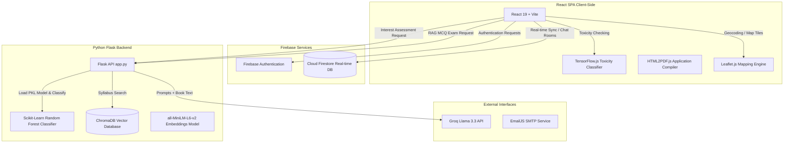
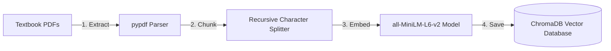
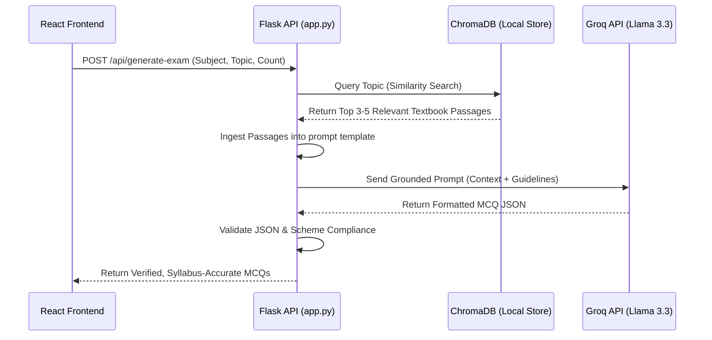

# Project Scope Document: EduNest
**Project Type:** Final Year Project (FYP)  
**Document Purpose:** Comprehensive Project Scope, Technical Architecture, Current Implementations, and RAG Integration Blueprint  

---

## 1. Executive Summary & Core Objectives

EduNest is an AI-powered educational counseling, exploration, and admission ecosystem designed to guide intermediate (FSc) students through their university transition. The platform consolidates interest assessment, academic roadmaps, university comparisons, transport maps, admission applications, community discussions, and entry test preparation into a unified platform. 

The system leverages Machine Learning (ML) to run interest predictions, Natural Language Processing (NLP) to generate study roadmaps, neural networks inside the client browser to block toxic content, and Retrieval-Augmented Generation (RAG) to generate syllabus-grounded, zero-hallucination entry test questions.

The core objectives of the system are:
1. **Intelligent Student Counseling:** Evaluate student interests using quantitative ML models to recommend suitable academic disciplines.
2. **Unified Exploration & Admissions:** Onboard universities, programs, scholarships, and transport details, allowing students to apply and managers to process applications in real-time.
3. **Dynamic Geography Mapping:** Provide location-aware maps to calculate proximity and routes using open-source, credential-free geolocators.
4. **Syllabus-Grounding Test Preparation:** Build a secure, local RAG pipeline to generate FSc-aligned MDCAT/ECAT mock exams, preventing AI errors.
5. **Distributed Platform Governance:** Maintain clear role-based operations for Students, University Managers, and Platform Admins with automated moderation.

---

## 2. System Architecture & Tech Stack

EduNest uses a hybrid architecture combining a React SPA client, a serverless Firebase backend, and a custom Python Flask microservice for CPU-intensive data operations and local model matching.

### Full Technical Matrix
* **Frontend Web Core:** React (v19.2.0), Vite (build runner), Tailwind CSS (v3.4.19) for layout design, Framer Motion (v12.27.3) for smooth animations, React Router DOM (v7.12.0) for routing, and Lucide React for consistent icons.
* **Database & BaaS Layer:** Firebase Authentication (session and security tokens), Cloud Firestore (NoSQL document store with live snapshot queries).
* **Machine Learning & NLP Services:** Python (v3.x), Flask microserver, Scikit-Learn (Random Forest model), Joblib (model loading), Pandas, and NumPy.
* **Retrieval-Augmented Generation (RAG):** `ChromaDB` (local vector engine), `sentence-transformers/all-MiniLM-L6-v2` (384-dimensional vector embedding model running locally on CPU), `pypdf` (PDF processing), and `langchain-text-splitters` (text parsing).
* **Utility & External API Integrations:** Groq Cloud API (`llama-3.3-70b-versatile`), EmailJS (OTP verification mail service), HTML2PDF.js (client-side PDF generation), and Leaflet.js (interactive mapping with OpenStreetMap tiles).

---

## 3. Database Design: Firestore Schemas

EduNest structures its NoSQL database inside Cloud Firestore. Key collections and their fields are mapped below:

### A. Users Collection (`/users/{uid}`)
Stores user profiles, access credentials, and role assignments.
* `uid` (string): Unique identifier from Firebase Auth.
* `name` (string): Full name of the user.
* `email` (string): Verified email address.
* `role` (string): Access level (`student`, `university_manager`, or `admin`).
* `isApproved` (boolean): Approval flag (for managers).
* `city` (string): Home location used for proximity calculations.
* `academicProfile` (map): Contains matriculation percentage, intermediate percentage, and subject groups.
* `interest` (string): Result of the interest assessment quiz.

### B. Universities Collection (`/universities/{id}`)
Contains university profiles, locations, and facilities.
* `id` (string): Document ID.
* `name` (string): Name of the university.
* `description` (string): Institutional background.
* `logo` / `banner` (string): URL paths for assets.
* `city` (string): City where the campus is located.
* `latitude` & `longitude` (number): GPS coordinates set via Leaflet picker.
* `facilities` (array): List of campus amenities (e.g., Gym, Labs, Hostel).
* `calculatedRating` (number): Average rating derived from student feedback.

### C. Programs Collection (`/degrees/{id}`)
Maintains the list of academic programs offered across all universities.
* `id` (string): Document ID.
* `title` (string): Program name (e.g., BS Computer Science).
* `duration` (string): Number of semesters/years.
* `fee` (number): Tuition fee per semester.
* `seats` (number): Seat capacity.
* `eligibility` (number): Minimum intermediate percentage required.
* `universityId` (string): Reference linking the program to its parent university.
* `scholarships` (array): Array of scholarship IDs applicable to this degree.

### D. Applications Collection (`/applications/{id}`)
Tracks admission applications submitted by students.
* `id` (string): Document ID.
* `studentId` (string): Reference to the student's user profile.
* `universityId` (string): Reference to the university.
* `programId` (string): Reference to the program.
* `status` (string): Selection state (`pending`, `accepted`, or `rejected`).
* `submittedAt` (timestamp): Date of submission.
* `resultDetails` (map): Result stats attached to the application.

---

## 4. User Roles & System Permissions

```mermaid
gantt
    title User Access & Action matrix
    dateFormat  X
    axisFormat %s
    section Student Portal
    Interest Assessment Quiz     :active, 0, 10
    Explore Universities & Programs :active, 0, 10
    Apply for Admissions         :active, 0, 10
    Generate Study Roadmaps      :active, 0, 10
    Take Anti-Cheat Mock Exams   :active, 0, 10
    section Manager Portal
    Onboard University Profile  :crit, 5, 15
    Add Programs & Scholarships  :crit, 5, 15
    Process Student Applications :crit, 5, 15
    Manage Faculty & Transport   :crit, 5, 15
    section Admin Portal
    Approve / Reject Managers    :milestone, 8, 8
    Moderate Users & Content     :milestone, 8, 8
    Moderate Ratings & Reviews   :milestone, 8, 8
```

### Roles & System Permissions Grid

| Module Block | Student Role | Manager Role | Admin Role |
| :--- | :--- | :--- | :--- |
| **User Access & Approvals** | Read/Write (Self-registration & profile updates) | Read/Write (Self-registration, waits in approval status) | Read/Write (Approve/Reject managers, Delete/Ban accounts) |
| **Interest Assessment** | Read/Write (Take adaptive quiz, save predicted interest field) | No Access | Read Only (View predicted interest fields in profiles) |
| **Study Roadmaps & Exams** | Read/Write (Generate AI milestone timelines, take topic tests) | No Access | No Access |
| **Mock Entrance Exams** | Read/Write (Generate textbook-grounded RAG questions, take timed MDCAT/ECAT tests with active tab anti-cheat detection) | No Access | No Access |
| **Certificates & Awards** | Read Only (Earn certificates by passing grand tests with >=75% score, view & download) | No Access | Read Only (Audit and view all issued certificates across the system) |
| **University Listings** | Read Only (Browse campuses by location proximity and matching score, write ratings & reviews) | Read/Write (Onboard and manage university profile settings, descriptions, galleries, logo) | Read Only (Browse listings, delete toxic or spam reviews) |
| **Academic Programs** | Read Only (Explore degree catalog, filter semester fees & eligibility) | Read/Write (Onboard and manage university degrees & eligibility criteria) | No Access |
| **Faculty Profiles** | Read Only (View university faculty details on university pages) | Read/Write (Add, update, or remove faculty members and headshots) | No Access |
| **Transport Management** | Read Only (Check routes, stops, and geographic paths on Leaflet map overlays) | Read/Write (Add and manage bus details and route stop coordinates) | No Access |
| **Admissions Engine** | Read/Write (Apply, upload matric/inter result cards to Cloudinary, download PDF worksheet) | Read/Write (Approve/Reject applications, view transcripts, export reports) | No Access |
| **Scholarship Matcher** | Read Only (Explore matched merit/need awards based on FSc eligibility) | Read/Write (Add and update scholarship listings) | No Access |
| **Community Feed / Forum** | Read/Write (Publish posts, like posts, add comments/replies, delete own posts). Subject to TensorFlow.js moderation. | Read/Write (Publish posts representing university, like posts, add comments, delete own posts). Subject to TensorFlow.js moderation. | Read/Write/Delete (Global Moderator: can publish, comment, and delete ANY post/comment. Subject to TensorFlow.js moderation). |
| **Direct Messaging (Chat)** | Read/Write (Direct chat with university managers) | Read/Write (Direct chat with interested students) | No Access (Direct messages are private to protect user privacy) |

---

## 5. Functional Modules Deep Dive: What We Built & How It Works

### A. Authentication, Onboarding & Security
* **OTP Verification:** During student registration, the React app triggers `EmailJS` to send a 6-digit verification code to the student's email. This code must be matched to activate the account.
* **Onboarding & Approval Gates:** When a university manager registers, they submit credentials and institutional proof. The client routes them to an `/approval-status` wait screen. React Router guards check their `isApproved` status from the Firestore `/users` collection, preventing dashboard access until an Admin marks it as `true`.
* **Password Management:** Handled securely via Firebase Auth, supporting email password resets and active password change screens.
* **Cloudinary Image Upload Engine:** To avoid storing large media files in Firestore, all images are hosted on Cloudinary via its client-side REST API.
  - *Single Uploads (`uploadToCloudinary`):* Used for student profiles, manager avatars, university logos, and faculty headshots.
  - *Batch Uploads (`uploadMultipleToCloudinary`):* Triggers concurrent uploads using `Promise.all` for university infrastructure galleries, transport buses, and student academic result cards, ensuring faster load times without blocking the main UI thread.
  - *Pre-Upload Validation:* The `validateImageFile` utility checks formats (JPG, PNG, WebP) and restricts sizes to prevent network overhead before sending files to the Cloudinary endpoint.

### B. Interactive Maps & Location Services
* **LeafletLocationPicker:** Used during university onboarding. Managers search for their location or drag a pin on an interactive map. Geocoding (converting address names to coordinates) is powered by Leaflet and the Nominatim API without requiring external keys.
* **LeafletCampusView:** Used on the student details page. It displays the campus on a map utilizing theme-aware layers:
  - *Light Mode:* CartoDB Voyager vector tiles.
  - *Dark Mode:* CartoDB Dark Matter slate tiles.
  - Custom SVG icons are used instead of default Leaflet markers to prevent build errors in production.

### C. Student Counseling & Interest Assessment
* **The Adaptive Quiz Engine:** Students take a quiz that adapts based on their answers, avoiding static, repetitive questioning. The quiz draws from a bank of 70 questions across 7 fields (Computer Science, Mathematics, Physics, Biology, Chemistry, Psychology, Graphics).
* **Machine Learning Backend:**
  - Standard student counseling uses a **Random Forest Classifier** trained in Python (`scikit-learn`) and hosted on the Flask microserver.
  - The frontend maps quiz responses into a 15-dimensional vector (averaging scores for each field).
  - The vector is sent to the Flask `/predict-step` endpoint, which uses the model's `predict_proba()` method to compute real-time probability estimates for the 7 fields.
* **Adaptive Questioning Logic:**
  - *Phase 1 (Baseline Sampling):* Asks one question from each category. If interest in a single category is strong (confidence crosses 75%), the quiz skips straight to Phase 2.
  - *Phase 2 (Drill-Down):* Focuses on the top predicted category, asking harder questions. If the student answers "Yes", the quiz continues with that category; if "No", the engine applies a **40% penalty decay** to that field's score and switches to the second highest category.
  - *Phase 3 (Tie-Breaker):* If scores are close after 18 questions, the engine asks contrast questions from the top two categories to determine a clear winner.
  - *Results saving:* The final interest (e.g., Computer Science, Match: 95%) is saved to Firestore under `/users/{uid}/interest`.

### D. Study Roadmaps & Anti-Cheat Quizzes
* **AI Roadmap Generation:** Based on the predicted interest, the system queries the Groq API (`llama-3.3-70b-versatile`) to generate a study roadmap. The model outputs a structured JSON timeline of milestones, sub-topics, and academic references, which is saved to Firestore under `/roadmaps` and displayed to the student.
* **Roadmap Learning Resources:** Each topic in the roadmap includes an interactive Learning Hub with integrated tutorial aids:
  - *YouTube Video Tutorials:* Dynamically fetches video tutorials using the **YouTube Search API v3** by forming query strings (e.g., `"${skill} ${topic} complete tutorial"`). If the API key (`VITE_YOUTUBE_API_KEY`) is active, it renders the top videos; otherwise, it falls back to a curated local set (e.g., Programming with Mosh, FreeCodeCamp).
  - *Offline Coursera Recommendation Engine:* To recommend courses without external API queries, the system embeds a dataset of Coursera courses (`COURSERA_DATASET`). It scores courses using a local heuristic algorithm:
    - *Exact Skill Match:* If the course title matches the roadmap skill (e.g., "MERN"), it gains **+100 points**.
    - *Related Keyword Match:* Checks titles and tags against related terms, awarding **+30 points per match**.
    - *Topic Specificity:* Checks matching subtopic keywords, awarding **+80 points**.
    - *Quality Boost:* High-rated courses (rating >= 4.5) receive a **+15 * rating** boost.
    - *Noise Penalty:* Courses with zero keyword matches receive a **-500 penalty**, filtering out irrelevant courses.
    - The top 15 highest-ranked, deduplicated courses are displayed.
* **Anti-Cheat Quiz Engine:** Each topic on the roadmap includes a test. To prevent cheating, the system monitors browser activity:
  - It listens to `visibilitychange` and `blur` events.
  - If a student leaves the quiz tab or opens another window, a warning popup appears.
  - If three warnings are recorded, the test is automatically aborted, saved to Firestore with an "Aborted" status, and scored as zero.

### E. AI Hybrid Recommendation System
* **Weighted Scoring Formula:** The system evaluates and ranks universities and programs for students using a multi-factor formula:
  
  $$\text{Score } (100) = \text{Academic Match (50%)} + \text{Geographical Proximity (30%)} + \text{Review Ratings (20%)} $$

* **Academic Interest Matching:** Scans university degrees for terms related to the student's academic interest (e.g., "Computer Science" matches CS, IT, software, coding, AI). 3+ matches yield 50 points, 2 matches yield 45 points, and 0 matches filter the university out.
* **Geographical Proximity Matching:**
  - *Active GPS:* Obtains the student's current coordinates using the browser's `navigator.geolocation` API and calculates the distance to the campus using the **Haversine Formula**:
    
    $$\text{Distance } (d) = 2R \times \arcsin\left(\sqrt{\sin^2\left(\frac{\Delta \text{lat}}{2}\right) + \cos(\text{lat}_1)\cos(\text{lat}_2)\sin^2\left(\frac{\Delta \text{lng}}{2}\right)}\right)$$
    
    Distances under 15 km receive 30 points, under 50 km receive 20 points, and under 150 km receive 15 points.
  - *Fallback:* If location access is denied, the system falls back to matching city names (same city = 30 points, different city = 10 points).
* **Review Ratings Strength:** Ratings are calculated using the formula:
  
  $$\text{Points} = \left(\frac{\text{Average Review Rating}}{5.0}\right) \times 20$$
  
  Universities without reviews receive a neutral baseline score of 14 points.

### F. Admission, Scholarship & Program Management
* **Merit Validation & Applications:** Students apply to degree programs using the `ApplyModal` popup, submitting their grades and transcripts. The system matches the student's academic record against the program's eligibility criteria and checks for scholarship eligibility before submitting the application to the university manager.
* **Custom Scholarship Rules:** Managers set up scholarships (Merit-based, Need-based, Kinship) inside the manager portal and link them to programs.
  - *Merit-based:* Automatically calculated based on Intermediate percentages (e.g., >85% = 50% waiver).
  - *Need-based:* Checked against self-reported family income thresholds (e.g., income < 50k = 100% tuition waiver).
  - *Kinship:* Applies if a sibling is enrolled.
* **Application Review & PDF Generation:** Managers review application details and accept or reject candidates, which updates Firestore and notifies the student. Managers can also download a copy of the application as a PDF using `html2pdf.js`.
* **Program Setup:** Managers can add, edit, or delete degree programs inside the manager portal. Students view a centralized list of programs across all universities with options to filter by fee limits, duration, and keyword searches.

### G. Faculty & Transport Directories
* **Faculty Management:** Managers maintain the list of campus faculty, detailing names, designations, departments, qualifications, and areas of expertise.
* **Transport Management:** Managers define bus schedules, routes, stops, and transport fees. Students view transit details on the university profile page to assess commute viability.

### H. Platform Governance & Admin Moderation
* **Account Approvals:** Admins review pending manager registrations, approving or rejecting them in the `/users` collection.
* **User Management:** Admins can ban, deactivate, or activate student or manager profiles that violate platform guidelines.
* **Review Moderation:** Admins moderate university reviews to filter out spam or inappropriate comments.

### I. Shared Collaboration Features
* **Real-Time Direct Chat System:** Students and university managers chat using a system powered by Firestore `onSnapshot` listeners. Rooms are generated with unique IDs via `uuid`, updating instantly for both parties.
* **AI Toxicity Moderation (TensorFlow.js):** The community forum lets users post questions. To prevent abuse, when a user clicks "Post", a client-side hook intercepts the text and runs it through a pre-loaded **TensorFlow.js Toxicity Model** in the browser. It checks the text against 7 toxicity categories:
  - If the text is classified as toxic with >85% confidence, the post is blocked, a warning is shown, and the data is not saved to the Firestore `/posts` collection.
  
  **Roles inside Community Forum:**
  - *Student:* Create posts, ask academic questions, comment on threads, and upvote discussions.
  - *Manager:* Post verified university updates and announcements, answer admission queries, and direct students to university portals.
  - *Admin:* Monitor all forum posts and comments, delete flagged content, and ban users violating policies.

---

## 6. RAG-Based MCQ Generation System (Current Upgrade Plan)

### A. The Core Problem
Previously, the entry test module sent prompts directly from the frontend to the Groq API, asking it to create MDCAT/ECAT questions. This setup caused:
1. **Hallucinations:** The AI generated questions with factual errors or incorrect answer keys.
2. **Out-of-Syllabus content:** The AI generated questions on topics outside the standard provincial intermediate curriculum.
3. **Security Risks:** The Groq API key was stored on the client side, exposing it to reverse engineering.

### B. The RAG Solution (How We Will Build It)
We are moving the MCQ generation to the custom Python/Flask backend and integrating a Retrieval-Augmented Generation (RAG) system using a local vector store.

#### 1. The Offline Data Pipeline (PDF Ingestion)

* **Step 1: Text Extraction:** A Python script reads the textbooks (Physics, Chemistry, Biology, Mathematics) page-by-page using the `pypdf` library.
* **Step 2: Dynamic Chunking:** The extracted text is split using `langchain-text-splitters` into chunks of 500 to 1,000 characters with a 100-character overlap, ensuring sentences aren't cut in half.
* **Step 3: Vector Embeddings:** Each text chunk is converted into a 384-dimensional vector using the local `sentence-transformers/all-MiniLM-L6-v2` model running on CPU.
* **Step 4: Vector Storage:** The embeddings and original text are saved in a local `ChromaDB` database inside `/python_backend/vector_db`. Each chunk is tagged with metadata (Subject, Chapter, Page Number).

#### 2. The Runtime MCQ Generation Flow

1. **Request:** The student requests an exam (e.g., Biology, topic: "Cell Division", 10 questions).
2. **Context Retrieval:** The Flask server queries ChromaDB using the search terms. ChromaDB performs a cosine similarity search on the embedded vector space and returns the top 3–5 most relevant paragraphs from the textbooks.
3. **Prompt Augmentation:** The Flask backend injects these textbook paragraphs into a secure prompt template. The prompt instructs the LLM to write multiple-choice questions **strictly** and **only** from the provided text, defining the required difficulty ratio (Easy: 20%, Medium: 60%, Hard: 20%) and outputting a clean JSON schema.
4. **LLM Generation:** The augmented prompt is sent to the Groq API (`llama-3.3-70b-versatile`) using the secure server-side API key.
5. **Validation:** The Flask backend checks the returned JSON structure. If the JSON is valid, it returns it to the client. If invalid, it falls back to a offline database (`fallback_mcqs.json`) or retries the generation.
